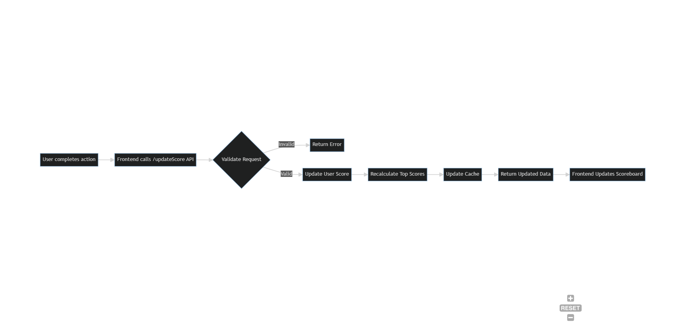

Overview
The scoreboard update module handles updating the scoreboard in real-time when a user completes an action that increases their score.

Requirements
Update displayed scoreboard dynamically when user score changes
Validate requests to prevent unauthorized score increments
Maintain sorted order of top 10 users by score
