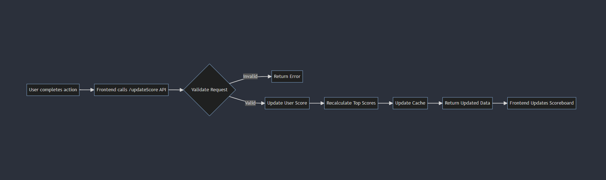

# Scoreboard Update Module 

## Overview

The scoreboard update module handles live updating the scoreboard when a user's score changes.

## Requirements

- Update displayed scoreboard in real-time when a user's score changes
- Validate API requests to prevent unauthorized score increments   
- Maintain sorted order of top 10 users by score

## Execution Flow 



1. User completes some action on frontend
2. Frontend calls POST /updateScore API with user id and score increment
3. API endpoint validates the request
    - Check for valid user session
    - Verify user identity
    - Validate score increment amount
4. For invalid requests, return error response
5. For valid requests, update user's score in database
6. Recalculate top 10 scores ordered by descending score
7. Update cached top 10 scores
8. Return updated scoreboard data
9. Frontend updates displayed scoreboard

## API Specification

`POST /updateScore`

**Request Body:**

```json
{
  "userId": "1234",
  "scoreIncrement": 10  
}
```
**Response**
```json
200 OK
{
  "scores": [
    {"userId": "1234", "score": 100},
    {"userId": "5678", "score": 90},
    ...
  ]
}
```
**400 BAD REQUEST**
```json
{
  "error": "Invalid score increment"
}
```

## Improvements
- Add rate limiting to prevent API spam
- Use a worker queue for asynchronous score recalculation (like Kafka or RabbitMQ)
- Implement a caching layer for improved efficiency (Redis or Memcached)
- Add metrics monitoring for analytics (like Prometheus and Grafana)